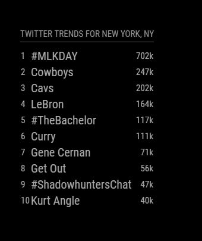

# Module: Twitter Trends By Place
The `MMM-TwitterTrendsByPlace` module is a module design to display the trending topics from Twitter based on a given locale. The trends are automatically sorted by the volume of tweets for that trending topic and then displayed in that order, optionally along with their rank and their tweet volume shown.

Example:

 

## Dependencies / Requirements

This module requires the use of the `twitter` package for node.js. To install this please run `npm install twitter` from the root directory of your Magic Mirror installation.

This module also requires Twitter access tokens and keys. For more information on acquiring these please visit <https://dev.twitter.com/oauth/overview/application-owner-access-tokens>.

You will need to set a WOEID value for the place (likely a city) to gather the trending topics for. WOEID values, aka "Where On Earth ID" values, are maintained by Yahoo! and can be searched for at <http://woeid.rosselliot.co.nz/lookup/>. 

<b>NOTE:</b> That while WOEID's exist for nearly every city or place on Earth, trending topics are only available for the very largest cities or places. If you discover an error when running this module change the WOEID to an appropriate very large city and try again.

To see a short, but not at all comprehensive, list of cities and their WOEID's please check the [woeid_short_list.md](woeid_short_list.md) file included in this repository. 

## Using the module

To use this module, add it to the modules array in the `config/config.js` file:
````javascript
modules: [
	{
		module: 'MMM-TwitterTrendsByPlace',
		position: 'bottom_left',
		config: {
		// visit the url below for the twitter keys/tokens
		// https://dev.twitter.com/oauth/overview/application-owner-access-tokens
			consumer_key: 'FILL IN',
			consumer_secret: 'FILL IN',
			access_token_key: 'FILL IN',
			access_token_secret: 'FILL IN',
		// set the display name/title for the place		
			placeName: 'New York, NY',
		// set the woeid for the place, see documentation for more
		// http://woeid.rosselliot.co.nz/lookup/
			placeWoeid: '2459115',
		}
	}	
]
````

## Configuration options

The following properties can be configured:

<table width="100%">
	<!-- why, markdown... -->
	<thead>
		<tr>
			<th>Option</th>
			<th width="100%">Description</th>
		</tr>
	<thead>
	<tbody>
		<tr>
			<td><code>consumer_key</code></td>
			<td>Used by the Twitter package in order to collect the trends. For more visit <a href="https://dev.twitter.com/oauth/overview/application-owner-access-tokens">https://dev.twitter.com/oauth/overview/application-owner-access-tokens</a>.<br>
			<br>This value is <b>REQUIRED</b>
			</td>
		</tr>
		<tr>
			<td><code>consumer_secret</code></td>
			<td>Used by the Twitter package in order to collect the trends. For more visit <a href="https://dev.twitter.com/oauth/overview/application-owner-access-tokens">https://dev.twitter.com/oauth/overview/application-owner-access-tokens</a>.<br>
			<br>This value is <b>REQUIRED</b>
			</td>
		</tr>
		<tr>
			<td><code>access_token_key</code></td>
			<td>Used by the Twitter package in order to collect the trends. For more visit <a href="https://dev.twitter.com/oauth/overview/application-owner-access-tokens">https://dev.twitter.com/oauth/overview/application-owner-access-tokens</a>.<br>
			<br>This value is <b>REQUIRED</b>
			</td>
		</tr>
		<tr>
			<td><code>access_token_secret</code></td>
			<td>Used by the Twitter package in order to collect the trends. For more visit <a href="https://dev.twitter.com/oauth/overview/application-owner-access-tokens">https://dev.twitter.com/oauth/overview/application-owner-access-tokens</a>.<br>
			<br>This value is <b>REQUIRED</b>
			</td>
		</tr>
		<tr>
			<td><code>placeName</code></td>
			<td>The name/title of the location for which the Twitter trending topics will be gathered for. This should match the place set by the <code>placeWoeid</code> value. However, it can be set to any string and allows the user to decide based on their display preference, i.e. could be "New York", "NYC", "New York, New York", "The Big Apple", etc.<br>
			<br><b>Example:</b> <code>New York, NY</code>
			<br>This value is <b>REQUIRED</b>
			</td>
		</tr>
		<tr>
			<td><code>placeWoeid</code></td>
			<td>The "Where On Earth ID"/WOEID value for the city or place you are trying to gather trending topics for. These can be searched for at <a href="http://woeid.rosselliot.co.nz/lookup/">http://woeid.rosselliot.co.nz/lookup/</a>. <b>NOTE:</b> Trending Topics are only available for the largest cities or places, if the WOEID you use does not work pick another large city or place and try again.<br>
			<br><b>Example:</b> <code>2459115</code>
			<br>This value is <b>REQUIRED</b>
			</td>
		</tr>		
		<tr>
			<td><code>numberOfTrendsToShow</code></td>
			<td>The number of trending topics to list. If set to 0 it will show all the trending topics for the place that have any tweet volume information available. Do note that the number of trending topics provided by Twitter is not fixed and can be many or just a few.<br>
				<br><b>Example:</b> <code>6</code>
				<br><b>Default value:</b> <code>10</code>
				<br>This value is <b>OPTIONAL</b>
			</td>
		</tr>
		<tr>
			<td><code>showTweetVolume</code></td>
			<td>Enable this to show the tweet volume for a particular trending topic, i.e. "1.31m", "378k", "13k", etc.<br>
				<br><b>Example:</b> <code>false</code>
				<br><b>Default value:</b> <code>true</code>
				<br>This value is <b>OPTIONAL</b>
			</td>
		</tr>
		<tr>
			<td><code>showTrendRank</code></td>
			<td>Enable this to show the rank of the trend, effectively the order after being sorted by the tweet volume, i.e. "1", "2", "3", etc.<br>
				<br><b>Example:</b> <code>false</code>
				<br><b>Default value:</b> <code>true</code>
				<br>This value is <b>OPTIONAL</b>
			</td>
		</tr>		
		<tr>
			<td><code>refreshRate</code></td>
			<td>Specified in <b>MINUTES</b>, set the speed at which the trending topics are updated. Note that if a value less than 15 is specified it will be set to 15; this is to prevent any possible over-polling of Twitter. Also, the trending topics are no updated nearly as often as a typical Twitter home timeline is.<br>
				<br><b>Example:</b> <code>45</code>
				<br><b>Default value:</b> <code>20</code>
				<br>This value is <b>OPTIONAL</b>
			</td>
		</tr>
		<tr>
			<td><code>fade</code></td>
			<td>Enables the fade effect as seen visibly moving down the trending topics. This is the identical effect as seen in the weather forecast default module.<br>
				<br><b>Example:</b> <code>true</code>
				<br><b>Default value:</b> <code>false</code>
				<br>This value is <b>OPTIONAL</b>
			</td>
		</tr>		
		<tr>
			<td><code>fadePoint</code></td>
			<td>The decimal percentage of where in the list of trending topics to begin the fade effect. This is identical to the effect seen in the weather forecast default module.<br>
				<br><b>Example:</b> <code>0.25</code>
				<br><b>Default value:</b> <code>0.5</code>
				<br>This value is <b>OPTIONAL</b>
			</td>
		</tr>		
	</tbody>
</table>
